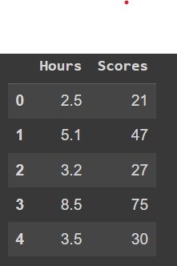
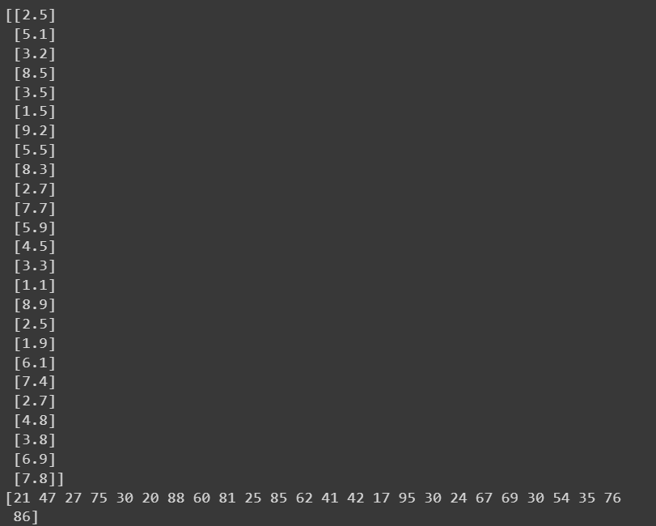
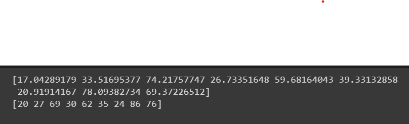
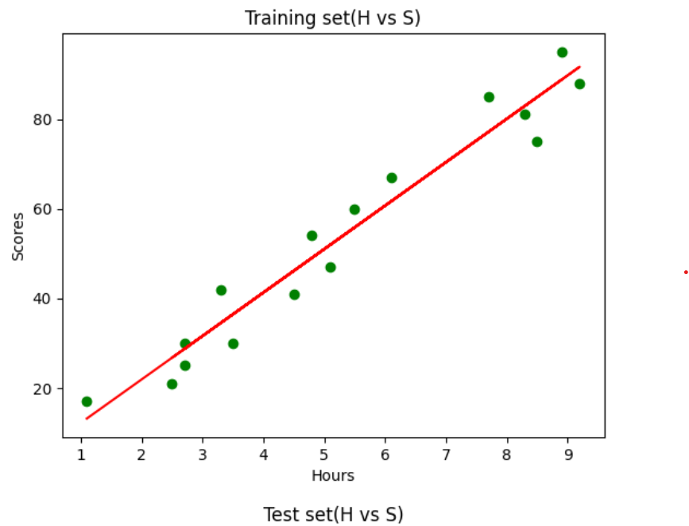
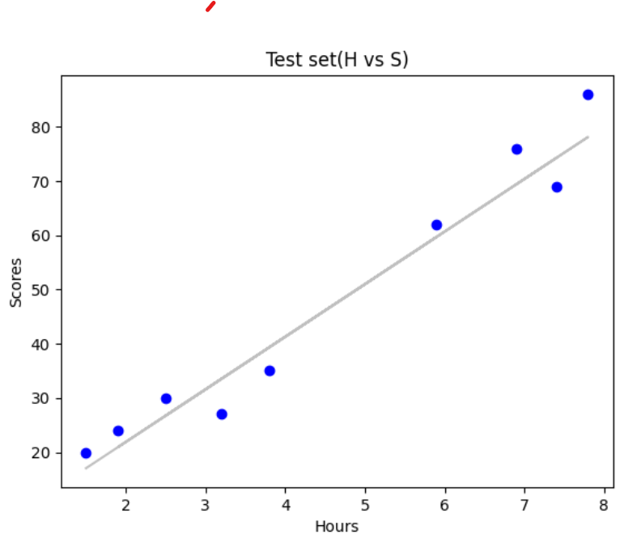
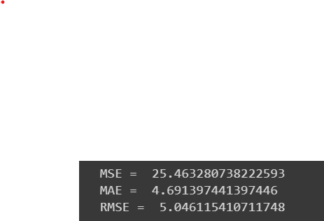
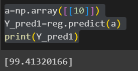

# Implementation-of-Simple-Linear-Regression-Model-for-Predicting-the-Marks-Scored

## AIM:
To write a program to predict the marks scored by a student using the simple linear regression model.

## Equipments Required:
1. Hardware – PCs
2. Anaconda – Python 3.7 Installation / Jupyter notebook

## Algorithm
1. import the required libraries and read the dataframe.
2.Assign hours to X and scores to Y.
3.Implement training set and test set of the dataframe.
4.Plot the required graph both for test data and training data.
5.Find the values of MSE , MAE and RMSE. 

## Program:
/*
Program to implement the simple linear regression model for predicting the marks scored.
Developed by: R Guruprasad
RegisterNumber:  212222240033
*/
```
import numpy as np
import pandas as pd
from sklearn.metrics import mean_absolute_error,mean_squared_error
import matplotlib.pyplot as plt

df.head()

#segregating data to variables

X=df.iloc[:,:-1].values
print(X)
Y=df.iloc[:,-1].values
print(Y)

#graph plot for training data

from sklearn.model_selection import train_test_split
X_train,X_test,Y_train,Y_test=train_test_split(X,Y,test_size=1/3,random_state=0)
#print(X_train,X_test,Y_train,Y_test)
from sklearn.linear_model import LinearRegression
reg=LinearRegression()
reg.fit(X_train,Y_train)
Y_pred=reg.predict(X_test)
print(Y_pred)
print(Y_test)

#graph plot for test data

plt.scatter(X_train,Y_train,color="green")
plt.plot(X_train,reg.predict(X_train),color="red")
plt.title("Training set(H vs S)")
plt.xlabel("Hours")
plt.ylabel("Scores")
plt.show()
plt.scatter(X_test,Y_test,color="blue")
plt.plot(X_test,reg.predict(X_test),color="silver")
plt.title("Test set(H vs S)")
plt.xlabel("Hours")
plt.ylabel("Scores")
plt.show()

mse=mean_squared_error(Y_test,Y_pred)
print("MSE = ",mse)
mae=mean_absolute_error(Y_test,Y_pred)
print("MAE = ",mae)
rmse=np.sqrt(mse)
print("RMSE = ",rmse)

a=np.array([[10]])
Y_pred1=reg.predict(a)
print(Y_pred1)
```

## Output:









## Result:
Thus the program to implement the simple linear regression model for predicting the marks scored is written and verified using python programming.
